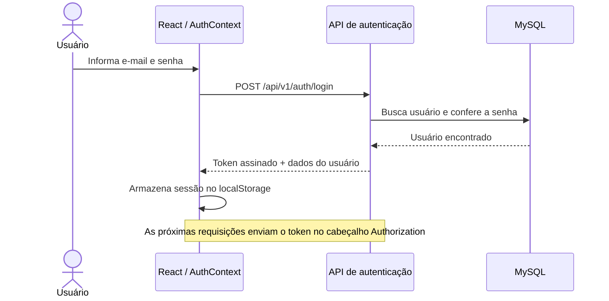
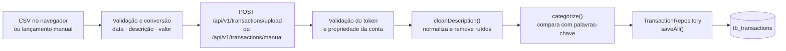
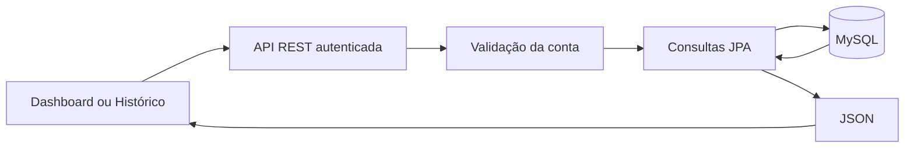

<div align="center">
    
   
    ███╗   ██╗███████╗██╗  ██╗██╗   ██╗███████╗
    ████╗  ██║██╔════╝╚██╗██╔╝██║   ██║██╔════╝
    ██╔██╗ ██║█████╗   ╚███╔╝ ██║   ██║███████╗
    ██║╚██╗██║██╔══╝   ██╔██╗ ██║   ██║╚════██║
    ██║ ╚████║███████╗██╔╝ ██╗╚██████╔╝███████║
    ╚═╝  ╚═══╝╚══════╝╚═╝  ╚═╝ ╚═════╝ ╚══════╝
    F I N A N C E
    
    Open Finance Data Engine
    
    Ingestão · Sanitização · Categorização automática de transações financeiras


</div>

---

## Sobre o projeto

O **Nexus Finance** é um sistema full-stack focado na ingestão, sanitização e categorização automática de transações financeiras. O sistema simula o recebimento de extratos bancários brutos no padrão Open Finance, limpa os ruídos dos dados, aplica regras de negócio para categorizar despesas e expõe esses dados via endpoints REST para consumo de interfaces web e mobile.

> **Por que Nexus?** Nexus significa *ponto de conexão* — exatamente o que o sistema faz: conectar dados financeiros brutos a insights estruturados e acionáveis.

---

## Conheça o Nex

O Nexus Engine conta com o **Nex**, um assistente de IA embutido no app que aparece na tela com insights personalizados baseados nos seus próprios gastos.

```
    ╭─────────────────────────────╮
    │  Você gastou 38% a mais em  │
    │  iFood este mês!            │
    ╰──────╮──────────────────────╯
           │
        ╭──┴──╮
       ╭╯ ◉ ◉╰╮   ← Nex, seu amigo financeiro
       │   N   │
       ╰───────╯
```

O Nex tem 5 estados de animação:

| Estado | Quando aparece | Cor de acento |
|--------|----------------|---------------|
| **Idle** | Dashboard aberto | `#7F77DD` Violet |
| **Insight** | Padrão de gasto detectado | `#1D9E75` Teal |
| **Alerta** | Limite de categoria ultrapassado | `#E24B4A` Red |
| **Feliz** | Meta de economia batida | `#AFA9EC` Light Violet |
| **Pensando** | Processando extrato CSV | `#534AB7` Purple |

---


## Arquitetura

O Nexus Finance segue uma arquitetura cliente-servidor em camadas. O front-end React
controla navegação, sessão e apresentação; o back-end Spring Boot concentra
autenticação, regras de negócio e persistência.

```mermaid
flowchart LR
    subgraph Client["Front-end · React + TypeScript"]
        Pages["Páginas<br/>Login · Dashboard · Importar<br/>Adicionar · Histórico · Perfil"]
        Auth["AuthContext + PrivateRoute<br/>sessão e rotas protegidas"]
        Api["api.ts<br/>cliente HTTP + Bearer token"]
        Pages --> Auth
        Pages --> Api
        Auth --> Api
    end

    subgraph Server["Back-end · Spring Boot"]
        Security["Spring Security + AuthFilter<br/>validação do token HMAC-SHA256"]
        Controllers["Controllers REST<br/>Auth · User · Account<br/>Transaction · Category · Analytics"]
        Services["Services<br/>autenticação · contas · usuários<br/>motor de transações · analytics"]
        Repositories["Spring Data JPA<br/>Repositories"]
        Security --> Controllers
        Controllers --> Services
        Services --> Repositories
    end

    DB[("MySQL<br/>tb_users · tb_accounts<br/>tb_categories · tb_transactions")]

    Api -- "JSON / HTTP<br/>/api/v1" --> Security
    Repositories --> DB
```



### Responsabilidades das camadas

| Camada | Responsabilidade |
|--------|------------------|
| **Interface** | Renderiza as telas, protege rotas privadas e mantém o usuário autenticado no `AuthContext`. |
| **Cliente HTTP** | Centraliza a URL da API, serializa JSON e envia `Authorization: Bearer <token>`; respostas `401` encerram a sessão local. |
| **Segurança** | Mantém a API stateless, valida assinatura e expiração do token e identifica o usuário da requisição. |
| **Controllers** | Expõem os endpoints REST, validam o acesso do usuário à conta e convertem entidades em respostas da API. |
| **Services** | Aplicam regras de cadastro, autenticação, sanitização, categorização, importação e consolidação financeira. |
| **Repositories** | Executam persistência, paginação e consultas agregadas por meio do Spring Data JPA. |
| **Banco de dados** | Armazena usuários, contas, categorias e transações, incluindo a origem `CSV` ou `MANUAL`. |

### Fluxo de dados

#### 1. Autenticação



O token é assinado com HMAC-SHA256, contém o identificador do usuário e expira em
8 horas. Ao recarregar a aplicação, o front-end valida a sessão em
`GET /api/v1/users/me`.

#### 2. Entrada e processamento de transações



Na importação, o arquivo CSV é lido pelo próprio front-end e convertido em JSON
antes do envio. O motor aceita até 10.000 transações por lote, registra a origem
como `CSV` (ou `MANUAL` no lançamento individual), limpa a descrição e procura a
primeira categoria cuja palavra-chave apareça no texto. Sem correspondência, usa
a categoria **Outros**.

Exemplo de transformação:

```text
Entrada:    "COMPRA VISA*1234 UBER EATS SAO PAULO"
Descrição:  "UBER EATS"
Categoria:  "Transporte"
Persistido: descrição original + descrição limpa + categoria + valor + data + origem
```

#### 3. Consulta e apresentação



- O **Histórico** consulta `/api/v1/transactions/account/{accountId}`, com paginação e
  filtro opcional por origem (`CSV` ou `MANUAL`).
- O **Dashboard** carrega as contas do usuário, busca o resumo mensal de cada uma
  em `/api/v1/analytics/{accountId}/summary` e reúne saldos, receitas, despesas,
  categorias e transações recentes na interface.
- As totalizações são calculadas no banco para o mês atual; o saldo é
  `receitas - despesas`.

---

## Stack tecnológica

### Back-end
| Tecnologia | Versão | Função |
|------------|--------|--------|
| Java | 21+ | Linguagem principal |
| Spring Boot | 3.x | Framework web |
| Spring Data JPA | 3.x | ORM / persistência |
| Hibernate | auto | Geração de DDL |
| MySQL | 8.x | Banco de dados relacional |
| Maven | 3.x | Build e dependências |

### Front-end / Mobile
| Tecnologia | Versão | Função |
|------------|--------|--------|
| React | 18.x | Interface web |
| JavaScript / TypeScript | ES2022+ | Linguagem |
| Chart.js | 4.x | Gráficos de analytics |
| CSS Custom Properties | — | Design tokens da marca |

---

## Modelagem de dados

```sql
-- Usuários do sistema
CREATE TABLE tb_users (
  id   VARCHAR(36) PRIMARY KEY,  -- UUID
  name VARCHAR(100) NOT NULL,
  cpf  VARCHAR(14)  NOT NULL UNIQUE
);

-- Contas bancárias
CREATE TABLE tb_accounts (
  id        VARCHAR(36) PRIMARY KEY,
  user_id   VARCHAR(36) NOT NULL REFERENCES tb_users(id),
  bank_name VARCHAR(50) NOT NULL  -- Ex: Nubank, Itaú, Inter
);

-- Dicionário de categorias
CREATE TABLE tb_categories (
  id       BIGINT AUTO_INCREMENT PRIMARY KEY,
  name     VARCHAR(50)  NOT NULL,  -- Ex: Alimentação
  type     ENUM('INCOME','EXPENSE') NOT NULL,
  keywords VARCHAR(500) NOT NULL   -- Ex: IFOOD,MCDONALDS,BURGERKING
);

-- Tabela transacional
CREATE TABLE tb_transactions (
  id               VARCHAR(36)    PRIMARY KEY,
  account_id       VARCHAR(36)    NOT NULL REFERENCES tb_accounts(id),
  category_id      BIGINT         REFERENCES tb_categories(id),
  raw_description  VARCHAR(255)   NOT NULL,  -- Como veio do banco
  clean_description VARCHAR(255)  NOT NULL,  -- Após o motor
  amount           DECIMAL(15,2)  NOT NULL,
  transaction_date DATE           NOT NULL
);
```

---

## API RESTful

### `POST /api/v1/transactions/upload`

Recebe lote de transações brutas, processa sanitização e salva no banco.

```json
// Request Body
[
  {
    "date": "2025-07-01",
    "raw_description": "COMPRA VISA*1234 UBER EATS SAO PAULO",
    "amount": 42.90,
    "type": "EXPENSE"
  }
]

// Response 201 Created
{
  "message": "Lote processado com sucesso. 1500 registros inseridos."
}
```

---

### `GET /api/v1/transactions/account/{accountId}?page=0&size=20`

Retorna extrato limpo paginado do usuário.

```json
// Response 200 OK
{
  "content": [
    {
      "id": "uuid",
      "clean_description": "UBER EATS",
      "category": "Alimentação",
      "amount": 42.90,
      "transaction_date": "2025-07-01"
    }
  ],
  "page": 0,
  "size": 20,
  "total": 150
}
```

---

### `GET /api/v1/analytics/{accountId}/summary`

Totalização de gastos do mês atual por categoria.

```json
// Response 200 OK
{
  "total_income": 5000.00,
  "total_expense": 2100.00,
  "balance": 2900.00,
  "expenses_by_category": {
    "Alimentação": 800.00,
    "Transporte":  300.00,
    "Moradia":    1000.00
  }
}
```

> **RNF01:** Este endpoint resolve a query no banco e retorna em < 500ms.

---

## Motor de sanitização

```java
// Exemplo de como o motor funciona internamente
// ENTRADA:  "COMPRA VISA*1234 UBER EATS SAO PAULO"
// SAÍDA:    "UBER EATS"

public String cleanDescription(String raw) {
    return raw
        .replaceAll("[*]\\d+", "")        // remove *1234
        .replaceAll("COMPRA\\s+\\w+\\s+", "") // remove prefixo de compra
        .replaceAll("\\s{2,}", " ")        // remove espaços duplos
        .replaceAll("SAO PAULO|SP|RJ|MG", "") // remove cidades
        .trim();
}

public Category categorize(String cleanDesc) {
    if (cleanDesc.contains("UBER") || cleanDesc.contains("99"))
        return categoryTransporte;
    if (cleanDesc.contains("IFOOD") || cleanDesc.contains("MCDONALDS"))
        return categoryAlimentacao;
    // ...
    return categoryOutros;
}
```

## Como rodar localmente

### Pré-requisitos

- Java 21+
- Maven 3.8+
- Docker (para o MySQL)
- Node.js 18+ (para o front-end)

### 1. Suba o banco de dados

```bash
docker run --name nexus-mysql \
  -e MYSQL_ROOT_PASSWORD=nexus123 \
  -e MYSQL_DATABASE=open_finance_db \
  -p 3306:3306 \
  -d mysql:8
```

### 2. Configure o `application.properties`

```properties
spring.datasource.url=jdbc:mysql://localhost:3306/open_finance_db
spring.datasource.username=root
spring.datasource.password=nexus123
spring.jpa.hibernate.ddl-auto=update
spring.jpa.show-sql=true
```

### 3. Rode o back-end

```bash
mvn spring-boot:run
```

### 4. Rode o front-end

```bash
cd frontend
npm install
npm run dev
```

Acesse: `http://localhost:5173`

---

## Estrutura do projeto

```
nexus-engine/
├── src/
│   └── main/
│       ├── java/com/nexusengine/
│       │   ├── controllers/
│       │   │   ├── TransactionController.java
│       │   │   └── AnalyticsController.java
│       │   ├── services/
│       │   │   ├── TransactionEngineService.java
│       │   │   └── AnalyticsService.java
│       │   ├── repositories/
│       │   │   ├── TransactionRepository.java
│       │   │   ├── AccountRepository.java
│       │   │   ├── CategoryRepository.java
│       │   │   └── UserRepository.java
│       │   └── models/
│       │       ├── Transaction.java
│       │       ├── Account.java
│       │       ├── CategoryType.java
│       │       ├── Category.java
│       │       └── User.java
│       └── resources/
│           └── application.properties
├── frontend/
│   ├── src/
│   │   ├── screens/
│   │   │   ├── LoginScreen.jsx
│   │   │   └── Dashboard.jsx
│   │   ├── components/
│   │   │   └── Nex/           ← mascote com animações
│   │   └── index.css          ← design tokens da marca
│   └── package.json
├── docs/
│   └── nexus_engine_brand.docx
└── README.md
```

---

## ‍Autor

**Alisson Moreira**
Estudante de Engenharia de Software

---

<div align="center">

**NEXUS ENGINE** · Open Finance Data Engine · v1.0.0

*Construído com propósito, identidade e muito `System.out.println()` de debug.*

</div>
